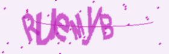
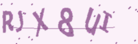

<div align="center">
  
  <h1>Captcha Bot 🤖🔒</h1>
  <p><b>Discord bot for secure and fun captcha verification</b></p>
  <a href="https://discord.gg/CfmuRQnn"></a>
  <br>
  
  
</div>

---

## ✨ Features

* 🚫 **Auto-kick**: Instantly removes users who fail verification
* 🔄 **3 Attempts**: Users get three chances to solve the captcha
* 🧩 **Unique Captchas**: 62<sup>6</sup> = <b>56,800,235,584</b> possible combinations
* 🟢 **Offline Mode**: No role required if bot is offline
* 🏢 **Multi-Guild Support**: *Coming soon!*

---

## 🚀 Getting Started

1. **Clone the repo**
	```bash
	git clone https://github.com/qrlmza/captcha-bot.git
	```
2. **Install dependencies**
	```bash
	pip install -r requirements.txt
	```
3. **Configure your bot**
	- Edit `config.json` with your Discord bot token and settings
4. **Run the bot**
	```bash
	python main.py
	```

---

## 🖼️ Captcha Samples

<details>
  <summary>Click to view examples</summary>
  
  
  
</details>

---

## 📚 How It Works

1. **User joins server**
2. **Bot sends captcha challenge**
3. **User solves captcha (3 tries max)**
4. **Success:** Role granted
5. **Failure:** User kicked

---

## 🛠️ Contributing

Pull requests and suggestions are welcome! Feel free to fork, star, or open issues.

---

## 💬 Community

Join our [Discord Server](https://discord.gg/CfmuRQnn) to chat, share ideas, or get help!

---

<div align="center">
  <sub>Made with ❤️ by <a href="https://github.com/qrlmza">qrlmza</a></sub>
</div>
